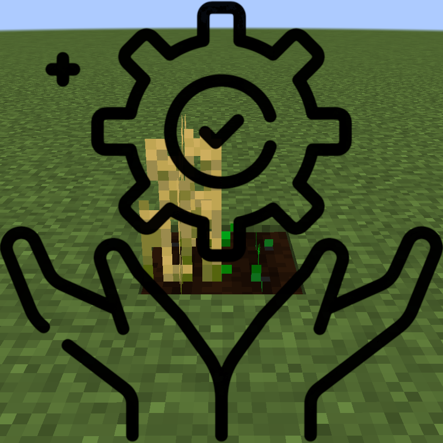

  <h1>Auto Crop Harvester</h1>
  

A fabric client-side mod to automatically harvest and replant crops in player proximity.

## Installation

### Modrinth

Id: h6cMODvx\
Slug: auto-crop-harvester\
URL: https://modrinth.com/mod/auto-crop-harvester

### CurseForge

Id: 1208878\
Slug: auto-crop-harvester\
URL: https://www.curseforge.com/minecraft/mc-mods/auto-crop-harvester

### Github

1. Download the `.jar` file from the release.
2. Place the `.jar` file into the `.mincraft/mods` folder
   - Windows: `%APPDATA%\.minecraft\mods`
   - Linux: `/home/user/.minecraft/mods`
3. Check that the mods `Fabric Api` and `Fabric Language Kotlin` are installed.
4. Done

For more information on how to install fabric, see: https://wiki.fabricmc.net/install

## How to use

To auto harvest walk over the crops.

To auto plant either break the crop with the harvester or manually, while the `auto_plant` option for either is enabled.\
The seed of the harvested crop must be somewhere in the inventory for it to work.\
The seeds are searched in the following order: Main Hand -> OffHand -> Hotbar -> Inventory

## Supported Crops

- Wheat
- Potato
- Carrot
- Beetroot
- Sugarcane
- Netherwart

## Keybinds

- Open Configuration: Unbound
  : Opens the configuration screen

## Screens

### Configuration

### Harvester

- Harvester
  : Enables or disables the harvester\
    Default: `Enabled` 

- Replant
  : Enables or disables the replanting of harvested crops\
    Default: `Enabled`

- Harvest Unripe
  : Enables or disables the harvesting of unripe crops\
    Default: `Disabled`

-  Sneak Harvest
  : Enables or disables the harvesting while sneaking\
    Default: `Disabled`

-  Harvest Radius
  : The radius around the player which gets harvested
    Default: `1`

### Player

- Replant
  : Enables or disables the replanting of broken crops\
    Default: `Enabled`

- Replant Unripe
  : Enables or disables the replanting of unripe crops\
    Default: `Enabled`
  